# AI-Powered Slack Bot with DevSecOps Architecture

This project is a complete **DevSecOps lifecycle** for a Python-based Slack Bot. It integrates AI (Google Gemini), a Database Service (Sashido), and real-time communication via Slack, all deployed automatically to a Kubernetes cluster using Infrastructure as Code (IaC).

## Slack Bot project

Repo for more information for Slack Bot: https://github.com/RadostSh/slack-bot-full-version

## Architecture & SDLC

The project follows modern **SDLC (Software Development Life Cycle)** phases, fully automated via GitHub Actions.

```mermaid
graph TD
    subgraph "Dev Workstation"
        Dev[👩‍💻 Developer] -->|Git Push| GH[GitHub Repo]
    end

    subgraph "CI Pipeline"
        GH -->|Trigger| Bandit["🛡️ SAST Scan (Bandit)"]
        Bandit -->|Pass| Docker[🐳 Docker Build]
        Docker -->|Scan| Trivy[🔍 Image Vulnerability Scan]
    end

    subgraph "CD Pipeline"
        Trivy -->|Pass| TF_Plan[📄 Terraform Plan]
        TF_Plan -->|Apply| TF_Apply[🏗️ Terraform Apply]
    end

    subgraph "Kubernetes Cluster"
        TF_Apply -->|Manage| NS[Namespace: slack-bot-iac]
        
        subgraph "Infrastructure"
            NS --> Secret[🔐 K8s Secrets]
            NS --> Deploy[🚀 Deployment]
            NS --> Svc["🌐 Service (NodePort)"]
            
            Secret -.->|Inject Vars| Deploy
            Deploy --> Pod[🤖 Slack Bot Pod]
        end
    end

    subgraph "External Services"
        Pod <-->|Socket Mode| Slack[Slack API]
        Pod <-->|AI Query| Gemini[Google Gemini AI]
        Pod <-->|Storage| DB[Sashido / Parse Platform]
    end

    style Bandit fill:#ffcccc,stroke:#333
    style Trivy fill:#ffcccc,stroke:#333
    style TF_Apply fill:#ccffcc,stroke:#333
    style Secret fill:#ffffcc,stroke:#333
```



------

## Technical Stack

| **Domain**               | **Tools Used**         | **Description**                                              |
| ------------------------ | ---------------------- | ------------------------------------------------------------ |
| **Code**                 | Python 3.9, Slack Bolt | Core application logic.                                      |
| **Containerization**     | Docker                 | Packaging the app into an isolated image.                    |
| **Orchestration**        | Kubernetes (K8s)       | Managing deployment, scaling, and self-healing.              |
| **IaC**                  | Terraform              | Provisioning K8s resources (Namespace, Secrets, Deployment). |
| **CI/CD**                | GitHub Actions         | Automating build, test, and deploy pipelines.                |
| **Security (SAST)**      | Bandit                 | Scanning Python code for security issues.                    |
| **Security (Container)** | Trivy                  | Scanning Docker images for OS/Library vulnerabilities.       |
| **AI & Data**            | Google Gemini, Sashido | AI intelligence and NoSQL database backend.                  |

------

## **Project Structure**

```
.
├── .github/
│   └── workflows/
│       └── pipeline.yaml    # CI/CD Workflow definition
├── app											 # Slack Bot logic
├── terraform/
│   └── main.tf              # Infrastructure as Code definition
├── Dockerfile               # Docker image instructions
├── requirements.txt         # Python dependencies
└── README.md                # Documentation
```

------

## CI/CD Pipeline Strategy: The "T-Shaped" Approach

This project adopts a **"T-Shaped" DevOps Solution**. This means the architecture is designed to have **Broad Coverage** across the entire SDLC, while maintaining **Deep Specialization** in Security (DevSecOps).

| Dimension              | Focus Area                | Description                                                  |
| :--------------------- | :------------------------ | :----------------------------------------------------------- |
| **Broad (Horizontal)** | **End-to-End Automation** | Covers Source Control, CI, CD, Containerization, IaC, Orchestration, and Cloud Integration. The pipeline connects GitHub, Docker, Terraform, and Kubernetes seamlessly. |
| **Deep (Vertical)**    | **Security (DevSecOps)**  | A deep dive into security scanning at multiple layers: Code level (SAST with Bandit) and Artifact level (Container Scanning with Trivy). |

---

## CI/CD Process Steps

The pipeline is defined in `.github/workflows/pipeline.yaml` and executes automatically on every push to the `main` branch.

### 1. Continuous Integration (CI)
The goal of this phase is to ensure code quality and security before building the artifact.

1.  **Checkout Code:** GitHub Actions pulls the latest code from the repository.
2.  **SAST Deep Dive (Static Application Security Testing):**
    * **Tool:** Bandit
    * **Process:** The pipeline installs Bandit and scans the Python source code **before** the Docker image is built.
    * **Goal:** Identify security flaws (e.g., hardcoded secrets, SQL injection risks) early in the development cycle.
3.  **Build Docker Image:**
    * The application is packaged into a lightweight Docker container.
    * Dependencies are installed via `requirements.txt`.
4.  **Container Vulnerability Scanning:**
    * **Tool:** Trivy
    * **Process:** Scans the newly built Docker image (`slack-bot:latest`) for vulnerabilities in the OS (Alpine/Debian) and Python libraries.
    * **Configuration:** configured to report **High/Critical** vulnerabilities.

### 2. Continuous Delivery (CD)
Once the code and image pass security checks, Infrastructure as Code (IaC) takes over to deploy the application.

5.  **Terraform Setup:**
    * Installs Terraform and configures the environment.
6.  **Terraform Init & Validate:**
    * Initializes the backend and verifies the syntax of `main.tf`.
7.  **Infrastructure Provisioning (Terraform Apply):**
    * Terraform communicates with the Kubernetes cluster.
    * **Secrets Injection:** Securely injects API Keys (Slack, Gemini, Sashido) from **GitHub Secrets** into **Kubernetes Secrets**.
    * **Deployment:** Creates/Updates the `Deployment` object to pull the local image.
    * **Service Exposure:** Ensures the internal Service matches the updated pods.

---

## Deep Dive: SAST (Static Application Security Testing)

### Why Bandit?
Since the bot is written in **Python**, **Bandit** was chosen as the specialized SAST tool. It parses the code into an Abstract Syntax Tree (AST) to find common security issues without executing the code.

### What does it check?
In this project, Bandit ensures:
* **No Hardcoded Tokens:** Verifies that API keys for Slack or Gemini are not written in plain text in **.py** files.
* **Secure Imports:** Checks that no dangerous libraries (like `pickle` for untrusted data) are used.
* **Command Injection Risks:** Flags the use of `shell=True` in subprocess calls, which prevents attackers from executing arbitrary OS commands on the container.

---

## Installation & Deployment

### Prerequisites

1. **Docker Desktop** (with Kubernetes enabled & running).
2. **Git** installed locally.
3. **GitHub Self-Hosted Runner:** Required to execute the pipeline on your local machine and access the local Kubernetes cluster (since GitHub Cloud cannot see `localhost`).

### Step 1: Clone the Repository

Bash

```bash
git clone [https://github.com/RadostSh/DevOps-Project.git](https://github.com/RadostSh/DevOps-Project.git)
cd DevOps-Project
```

### Step 2: Configure Secrets

Go to **Repository → Settings → Secrets and variables → Actions** and add the following:

- `TF_VAR_SLACK_BOT_TOKEN`
- `TF_VAR_SLACK_APP_TOKEN`
- `TF_VAR_GEMINI_API_KEY`
- `TF_VAR_SASHIDO_APP_ID`
- `TF_VAR_SASHIDO_REST_KEY`
- `TF_VAR_SASHIDO_API_URL`

### Step 3: Deploy via Pipeline

Simply push to the `main` branch to trigger the pipeline:

```bash
git push origin main
```

### Step 4: Verify Deployment

Once the pipeline is green, check the local cluster:

```bash
kubectl get pods -n slack-bot-iac
kubectl logs -n slack-bot-iac -l app=slack-bot
```

## Future Improvements

1. **Cloud Migration:**
   - Migrate Terraform provider to deploy on **AWS EKS** or **Google GKE** instead of local Docker Desktop.
2. **Horizontal Pod Autoscaling (HPA):**
   - Configure K8s to automatically add more replicas if CPU load increases.